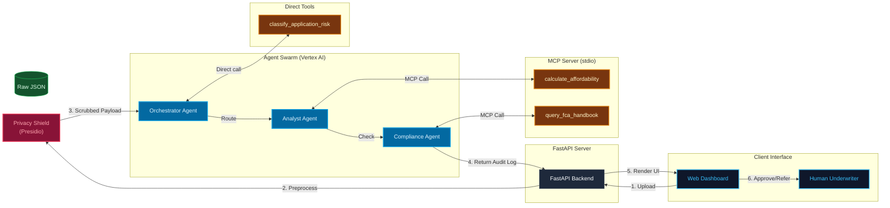

# MortgageStream AI

**MortgageStream AI** is a multi-agent UK mortgage decision-in-principle (DIP) pre-qualification system powered by Google ADK and wrapped in an asynchronous FastAPI dashboard.

---

## 1. The Problem: Specialist Underwriting & FCA Compliance

In the UK mortgage industry, underwriting specialist applications (such as self-employed directors, contractors, or applicants with adverse credit history or vulnerability drivers) is historically a major operational bottleneck. These cases do not fit standard automated scorecard algorithms, requiring high amounts of manual data extraction, checks, and administrative overhead. 

Furthermore, under the **FCA Consumer Duty (Principle 12)** and **MCOB guidelines**, firms are legally required to deliver good outcomes for retail consumers. Lending decisions must be transparent, consistent, and explainable, with a complete audit trail of how affordability calculations and regulatory rules were checked. Using raw generative AI to make these decisions directly introduces the risk of arithmetic errors, policy hallucinations, and non-compliant black-box outcomes.

---

## 2. The Solution: Dual-Workforce Agentic Architecture

MortgageStream AI solves this by deploying a **dual-workforce agentic architecture**:
1. **Deterministic Safeguards**: Mathematical computations, risk-routing decisions, and FCA Handbook query checks are implemented strictly in deterministic Python code as tools.
2. **Generative Swarm Pipeline**: специализированные agents process, inspect, and evaluate the application sequentially to extract insights and generate human-readable compliance explanations.
3. **Human-in-the-Loop**: The swarm does not make the final credit decision. It generates a structured pre-qualification recommendation and compliance audit log, leaving the final sign-off to a human underwriter.

---

## 3. Architecture Details

The system consists of the following components:

- **Privacy Shield Gateway**: A local, deterministic preprocessing layer that redacts sensitive PII (names, National Insurance numbers, bank details, emails, addresses, and postcodes) from the factfind data before it reaches the AI agents, ensuring GDPR data minimisation compliance.
- **google-adk SequentialAgent Swarm**:
  - **Orchestrator Agent**: Inspects the applicant profile and invokes `classify_application_risk` to route the file to `Standard` or `High-Risk`.
  - **Analyst Agent**: Evaluates affordability parameters using `calculate_affordability` to compute monthly commitments and Debt-To-Income (DTI) ratios.
  - **Compliance Agent**: Consults the regulatory database using `query_fca_handbook` to cite relevant MCOB rules and compiles the final audit log.
- **FastAPI Web Dashboard**: An asynchronous Python server that serves static dashboard files, scrubs uploaded files, and runs the ADK Runner asynchronously over HTTP without blocking.

---

## 4. Architecture Flowchart



---

## 5. Run Locally

1. Install system requirements:
   ```bash
   pip install -r requirements.txt
   ```

2. Create a local `.env` configuration file in the project root containing your Gemini API key:
   ```env
   GOOGLE_API_KEY=your_gemini_api_key_here
   ```

3. Launch the FastAPI server using Uvicorn:
   ```bash
   uvicorn submission_frontend.main:app --reload --port 8080
   ```

4. Open your browser and navigate to:
   [http://localhost:8080](http://localhost:8080)

---

## 6. Deploy to Cloud Run

To build the container image and deploy the application to Google Cloud Run, execute the following command in the project directory:

```bash
gcloud run deploy mortgagestream-ai \
  --source . \
  --platform managed \
  --region europe-west1 \
  --allow-unauthenticated
```

This will upload the workspace, build the container using the provided `Dockerfile`, and provision a public HTTPS URL. 

*(Ensure that the `GOOGLE_API_KEY` environment variable is configured in the Cloud Run service settings or passed via `--set-env-vars` at runtime; never hardcode credentials inside the codebase or the Docker container).*

---

## 7. Repository Structure

```
mortgage-stream-ai/
├── .agents/                    # Custom Workspace Skills
│   └── skills/
│       └── adding-underwriting-rules/
│           └── SKILL.md        # Underwriting skill conventions
├── data/                       # Mock Application Payloads
│   ├── standard_applicant.json # Employed PAYE applicant
│   └── complex_applicant.json  # Self-employed director with adverse credit
├── mortgage_agents/            # Agent swarm packages
│   ├── __init__.py             # Package entrypoint
│   ├── agent.py                # Swarm SequentialAgent setup
│   └── tools.py                # Deterministic underwriting tools
├── specs/                      # System Specifications
│   └── mortgagestream.md       # Project Single Source of Truth
├── submission_frontend/        # FastAPI Application
│   ├── static/
│   │   └── index.html          # Sleek single-page dashboard
│   ├── __init__.py
│   └── main.py                 # FastAPI backend routes
├── tests/                      # Testing Suite
│   ├── __init__.py
│   └── test_core.py            # Automated tests for core functionality
├── .dockerignore               # Container build ignore rules
├── .env                        # Local environmental secrets (git ignored)
├── .gitignore                  # Git ignore definitions
├── AGENTS.md                   # MortgageStream AI developer conventions
├── Dockerfile                  # Application deployment packaging
├── README.md                   # System documentation (This file)
└── requirements.txt            # System dependencies
```
