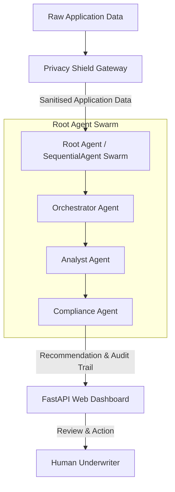

# MortgageStream AI Specification

This document serves as the single source of truth for the MortgageStream AI project. All components, databases, and agents must be built to conform to the requirements and contracts defined herein.

---

## 1. Purpose and Rationale

MortgageStream AI is a multi-agent UK mortgage decision-in-principle (DIP) system. Its primary objectives are to:
- **Pre-qualify Applicants**: Automatically process mortgage applications to verify eligibility based on detailed factfind data.
- **FCA-Explainable Audit Trail**: Generate transparent, reproducible, and explainable decision steps mapped to the Financial Conduct Authority (FCA) regulations.
- **Human-in-the-Loop**: Ensure that the final credit underwriting decision is reserved for a human operator, utilizing the automated output as a robust recommendation.
- **Privacy First**: Enforce strict data minimisation by scrubbing personally identifiable information (PII) before any data is sent to external Large Language Models (LLMs), ensuring compliance with GDPR.

---

## 2. Architecture Overview

The system uses a structured, pipeline-based flow to process underwriting requests securely and efficiently:



### Core Architecture Components:
1. **Privacy Shield Gateway**: A deterministic preprocessing layer that redacts structured and unstructured PII (such as names, National Insurance numbers, bank accounts, and contact details) prior to model invocation.
2. **ADK SequentialAgent Swarm**: A chain of specialised agents orchestrated via Google ADK:
   - **Orchestrator Agent**: Manages the application lifecycle and delegates specific analyses.
   - **Analyst Agent**: Examines financial data, computes debt ratios, and performs risk assessments.
   - **Compliance Agent**: Looks up FCA handbook guidelines and verifies regulatory compliance.
3. **FastAPI Web Dashboard**: An asynchronous web frontend displaying processed applications, redacted profiles, risk ratings, and the regulatory audit log.
4. **Cloud Run Deployment**: Containerised using Docker and deployed directly to Google Cloud Run.

---

## 3. Data Schema

The data schema for a mortgage applicant represents a standard UK residential mortgage factfind. Adverse credit is captured separately from vulnerability, matching real-world underwriting standards.

```yaml
personal_details:
  title: string                       # e.g., 'Mr', 'Mrs', 'Dr'
  forename: string                    # Redacted by Privacy Shield
  surname: string                     # Redacted by Privacy Shield
  previous_name: string               # Redacted by Privacy Shield (if applicable)
  date_of_birth: string               # ISO-8601 date (YYYY-MM-DD)
  sex: string                         # e.g., 'Male', 'Female', 'Other'
  marital_status: string              # e.g., 'Single', 'Married', 'Divorced'
  nationality: string                 # e.g., 'British'
  residency_status: string            # e.g., 'UK Resident'
  intended_retirement_age: integer    # Target age for retirement
  national_insurance_number: string   # Redacted by Privacy Shield
  number_of_dependants: integer       # Number of financial dependants

contact_details:
  mobile_telephone: string            # Redacted by Privacy Shield
  email: string                       # Redacted by Privacy Shield
  current_address: string             # Redacted by Privacy Shield
  postcode: string                    # Redacted by Privacy Shield
  residential_status: string          # 'owner', 'private renter', 'social renter', 'living with family', or 'other'
  time_at_address_years: number       # Duration at current address in years

bank_details:
  bank_name: string                   # e.g., 'Acme Bank'
  account_number: string              # Redacted by Privacy Shield (8-digit account number)
  sort_code: string                   # Redacted by Privacy Shield (6-digit sort code)
  account_holder_name: string         # Redacted by Privacy Shield

employment:
  employment_status: string           # 'Employed', 'Self-Employed', 'Retired', or 'Homemaker/Unemployed'
  occupation: string                  # Job title or occupation
  employer_name: string               # Company name (if employed)
  time_in_role_years: number          # Years in current position
  self_employment:                    # Nested block, optional unless Self-Employed
    business_name: string             # Redacted by Privacy Shield
    trading_style: string             # 'Sole trader', 'Partnership', 'Ltd Co', or 'LLP'
    percent_shareholding: number      # e.g., 100 for sole director
    years_trading: number             # Duration business has operated

income:                               # All annual amounts in GBP
  gross_basic_income: number          # Gross basic annual salary
  guaranteed_overtime_bonus_commission: number # Guaranteed variable pay
  variable_overtime_bonus_commission: number   # Non-guaranteed variable pay (or dividends/variable profits for directors)
  other_income: number                # Additional annual income (e.g., benefits, rent)
  other_income_source: string         # Description of the other income source

monthly_commitments:                  # List of outstanding credit obligations
  - provider: string                  # Redacted by Privacy Shield (e.g., credit provider name)
    commitment_type: string           # 'Credit card', 'Loan', or 'Hire purchase'
    balance_outstanding: number       # Remaining balance in GBP
    monthly_repayment: number         # Monthly repayment amount in GBP
    repay_on_completion: boolean      # True if this debt will be cleared before completion

adverse_credit:
  adverse_credit_flags: list          # List of negative credit indicators (e.g. 'ccj', 'default', 'bankruptcy_iva', 'recent_late_payment')

vulnerability:
  vulnerability_flags: list           # List of vulnerability drivers aligned to FCA's four drivers (health, life events, resilience, capability)

property:
  address: string                     # Redacted by Privacy Shield
  postcode: string                    # Redacted by Privacy Shield
  value: number                       # Current estimated value of the property in GBP
  purchase_price: number              # Agreed purchase price in GBP
  tenure: string                      # 'Freehold' or 'Leasehold'
  property_type: string               # e.g., 'House', 'Flat'
  deposit_amount: number              # Total deposit amount in GBP
  deposit_source: string              # e.g., 'Savings', 'Gifted'

mortgage_requirements:
  purpose: string                     # 'First-time buyer', 'Home mover', 'Remortgage', or 'Further advance'
  loan_amount: number                 # Requested loan amount in GBP
  term_years: integer                 # Requested term of the mortgage in years
  repayment_method: string            # 'Capital repayment', 'Interest only', or 'Part and part'
```

---

## 4. Tool Contracts

To ensure exactness and reliability, all calculations, routing rules, and regulatory lookups are kept outside the language model in deterministic python functions exposed as ADK tools.

### Tool 1: `classify_application_risk`
Classifies the routing category of the application using strict logical conditions.
- **Contract**:
  - **Inputs**: `employment_status` (str), `variable_income` (float), `vulnerability_flag_count` (int), `adverse_credit_flag_count` (int)
  - **Output**: `{ "classification": "Standard" | "High-Risk", "reasons": [string] }`
  - **Logic**: Routes to `High-Risk` if:
    1. `employment_status` (case-insensitive) matches `"self-employed"`, OR
    2. `variable_income` > `0.0`, OR
    3. `vulnerability_flag_count` > `0`, OR
    4. `adverse_credit_flag_count` > `0`.
    Otherwise routes to `Standard`.

### Tool 2: `calculate_affordability`
Performs summation, division, and ratio comparisons to evaluate affordability.
- **Contract**:
  - **Inputs**: `gross_basic_income` (float), `guaranteed_overtime_bonus_commission` (float), `variable_overtime_bonus_commission` (float), `other_income` (float), `monthly_repayments` (list of float)
  - **Output**: `{ "dti_percent": float, "decision": "Pass" | "Review" | "Fail", "error": string | null }`
  - **Logic**:
    1. Sum of Income = `gross_basic_income + guaranteed_overtime_bonus_commission + variable_overtime_bonus_commission + other_income`
    2. Guard against zero or negative total annual income.
    3. Sum of Monthly Commitments = sum of all values in `monthly_repayments`.
    4. Monthly Income = `Sum of Income / 12`
    5. Debt-to-Income (DTI) % = `(Sum of Monthly Commitments / Monthly Income) * 100` (rounded to 2 decimal places).
    6. **Decision Thresholds**:
       - `Pass`: DTI < 36%
       - `Review`: 36% <= DTI <= 45%
       - `Fail`: DTI > 45%

### Tool 3: `query_fca_handbook`
Provides unalterable, structured regulatory text for specific keywords to prevent model hallucinations.
- **Contract**:
  - **Inputs**: `keyword` (str)
  - **Output**: `{ "keyword": string, "rule": string }`
  - **Keywords**:
    - `self_employed`: Details MCOB SA302 requirements.
    - `vulnerability`: Details FG21/1 guidance on vulnerable customers.
    - `affordability`: Details MCOB affordability assessments.
    - `consumer_duty`: Details Principle 12 outcome delivery.
    - `adverse_credit`: Details regulatory checks for negative credit occurrences.

---

## 5. Environment and Version Pinning

To maintain reproducibility and environment stability, the project uses the following pinned runtime environment and versions:

### Model Configuration
- **Model**: `gemini-2.5-flash`
  > [!NOTE]
  > Verify the model name `gemini-2.5-flash` is current and supported in the deployment region before running builds.

### Dependencies
- `google-adk==2.3.0`
- `fastapi==0.115.0`
- `uvicorn[standard]==0.30.1`
- `python-multipart==0.0.9`
- `python-dotenv==1.0.1`
- `pytest==8.2.2`

---

## 6. Acceptance Scenarios (BDD Gherkin)

> [!NOTE]
> These BDD scenarios map directly onto the automated pytest test cases located in [tests/test_core.py](file:///c:/Users/chris/agy2-projects/my-first-project/mortgage-stream-ai/tests/test_core.py).

### Scenario 1: Standard salaried PAYE applicant
```gherkin
Scenario: Standard salaried PAYE applicant with low debt is approved subject to human review
  Given a mortgage applicant with employed PAYE status
  And the applicant has only basic salary with no variable income
  And the applicant has no adverse-credit flags
  And the applicant has no vulnerability flags
  When the application is processed through the MortgageStream AI pipeline
  Then the applicant's risk classification must be "Standard"
  And the calculated affordability decision must be "Pass" (once income and commitments are summed)
  And the final system recommendation must be "Approve (Subject to human sign-off)"
```

### Scenario 2: Self-employed director with adverse credit and variable income
```gherkin
Scenario: Self-employed applicant with variable dividends and late payments is routed for manual review
  Given a self-employed company director applicant
  And the applicant has variable overtime, bonus, or commission income
  And the applicant has a "recent_late_payment" adverse credit flag
  When the application is processed through the MortgageStream AI pipeline
  Then the applicant's risk classification must be "High-Risk" (due to self-employed status, variable income, and adverse credit)
  And the application must be routed for deeper affordability scrutiny
  And the final system recommendation must be "Manual Review Required"
```
